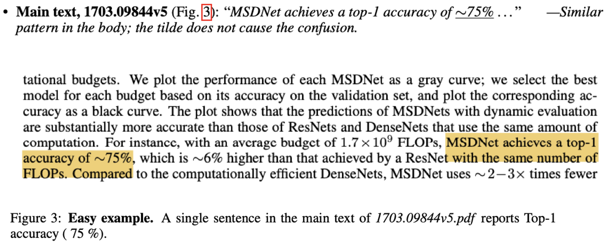
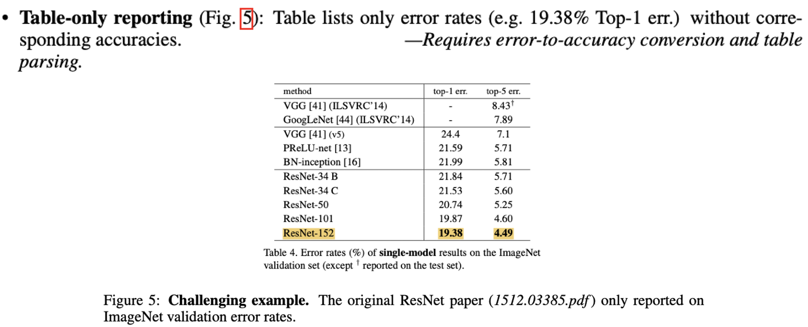

<div align="center">

# Extract-and-Verify  
### LLM-Driven Extraction of ImageNet Performance Metrics  


</div>

---

## ✨ Overview
Automatic leaderboards rely on one tedious step: **reading PDFs to find the reported metric**.  We present **Extract-and-Verify**, utilizing LLMs to extract performance metrics automatically from scientific literatures.

1. We collect a large dataset of publications that report Top-1 Accuracy on the
ImageNet dataset and manually annotate it.

2. We report that our system correctly extracts
the Top-1 accuracy in 67% on the development set, slightly outperformning prior work. Though we would report things with more statistical significance reporting results on test set.

---

> 📰 **News**  
> Our work has been **accepted to the NeurIPS 2025 LLM Evaluation Workshop**! 🎉  
> 📄 **Paper (OpenReview):** [https://openreview.net/pdf?id=p0DeYk22Xu](https://openreview.net/pdf?id=p0DeYk22Xu)

---

## 🖇 Project structure

```

extract-and-verify/
├── data/                 # dev set PDFs (git-ignored) + labels
└── experiments/            # experimental\_results.ipynb

````


---

## 📦 Dataset  (100 ImageNet papers)

A zip archive of PDFs plus page-level labels (CSV + JSON).  
Download instructions and column definitions are in [`data/readme.md`](data/readme.md).


---

## 🔍 Qualitative examples

<p align="center">
  
  
</p>

Left: single explicit Top-1 sentence in main texts (easy).
Right: Top-1 hidden in a table (hard).

---


## 🛠 Roadmap

* Expand dev set (500~1000 papers; multiple domains)
* Extend to Top-5, mAP, BLEU (multi-metric mode)
* Fine-tune LLM or add retrieval layer for robustness
* Plug into ARR-style reviewer dashboard for automatic claim checking

---


## 🗨 Contact

Questions or pull requests welcome!
Feel free to open an issue or ping **[mengli.duan@mail.utoronto.ca](mailto:mengli.duan@mail.utoronto.ca)**.


